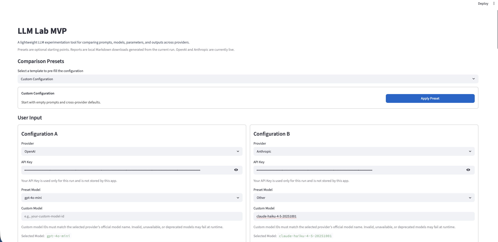

[](#license)
[](https://llm-lab-mvp.streamlit.app)
[](assets/llm-lab-preview.png)

# llm-lab-app

**llm-lab-app is a lightweight, public LLM experimentation MVP that helps users compare model/provider/prompt configurations using side-by-side outputs, approximate cost and context metrics, and a decision intelligence layer that explains which configuration is more useful and why.**


> Public release: static simulator + Streamlit MVP

---

## Table of Contents

- [Project Overview](#project-overview)
  - [Tech Stack](#tech-stack)
- [Application Access & Demos](#application-access--demos)
  - [Installation](#installation)
  - [Usage](#usage)
- [Features](#features)
- [Configuration](#configuration)
- [Repository Structure](#repository-structure)
- [Possible Extensions](#possible-extensions)
- [Security](#security)
- [License](#license)
- [Authors and Acknowledgment](#authors-and-acknowledgment)

---

## Project Overview

`llm-lab-app` (repository working name: `llm-lab-mvp`) is built for the **control, comparison, and understanding** of large language model behavior. It is designed for prompt engineering, model and parameter experimentation, token & cost visibility, context usage analysis, and output behavior evaluation.

### Tech Stack

- **Language:** Python 3.1x
- **Framework:** Streamlit
- **APIs:** OpenAI and Anthropic official Python SDKs
- **Version Control:** Git

### Application Interface Setup

The interface preview below shows the top configuration section. The full page of web-app is captured in multiple high-resolution screenshots available in the [screen-prints](assets/screen-prints/) folder.



---

## Application Access & Demos

Choose how you would like to explore the application:

- **[Live Web App](https://llm-lab-mvp.streamlit.app)**: Hosted on Streamlit Community Cloud.
- **[Static Simulator](assets/llm-lab-preview.png)**: Static screenshot demonstrating the UI concept.
- **[Screenprints](assets/screen-prints/)**: High-resolution screenshots of the workflow.

### Installation

For developers familiar with the Python ecosystem, here is how you can get the code and dependencies set up locally:

1. **Clone the repository:**
```bash
git clone https://github.com/davedepo/llm-lab-mvp.git
cd llm-lab-mvp
```

2. **Set up the virtual environment and install dependencies:**
```bash
python -m venv .venv
source .venv/bin/activate
pip install -r requirements.txt
```

Provide API keys in the Streamlit UI or place them in the local `.env` file. Keys entered in the UI are used for the current run only.

### Usage

To run the Streamlit application locally after installation:

1. **Set up environment variables:**
```bash
cp .env.example .env
```
*(Optional: You can provide API keys directly in the Streamlit UI, or place them in this local `.env` file.)*

2. **Run the application:**
```bash
streamlit run app/streamlit_app.py
```

Keys entered in the UI are used for the current run only and are not persisted.

---

## Features

1. **Multi-Provider Support**: 
   Working live integrations for **OpenAI** and **Anthropic**. Google Gemini, Mistral, and Cohere are included as UI placeholders for future expansion.
2. **Dynamic A/B Comparison**: 
   Independent controls for each configuration, allowing variable comparison (system instructions, user prompts, models, and parameters) side-by-side.
3. **Decision Intelligence**: 
   A qualitative, deterministic layer assessing completeness, structural differences, and use-case recommendations.
4. **Approximate Metrics**: 
   Calculates run latency, estimated tokens, cost, and context pressure relative to the model window.
5. **Security-First Architecture**: 
   Uses bring-your-own-key runtime variables without persisting credentials.

---

## Configuration

### Model Selection
Each test/use-case can use a preset model or a custom model ID. If a custom model ID is entered, the preset model selector is treated as `Other`. Ensure that custom model identifiers match the provider's official naming convention.

### Metric Calculations and Customization
The application calculates runtime and token-utilization heuristics natively. To calibrate or add pricing data for new models, update the values directly in `app/metrics.py`:

```python
# app/metrics.py structure for updating costs and context limits
PRICING_DEFAULTS = {
    "gpt-4o-mini": {"input_cost_per_m": 0.15, "output_cost_per_m": 0.60},
    "claude-3-5-sonnet-latest": {"input_cost_per_m": 3.00, "output_cost_per_m": 15.00},
}
```
* **Response time:** Elapsed provider call time.
* **Cost estimates:** Calculated by multiplying the token counts by the pricing metadata constants defined in `app/metrics.py`.

---

## Repository Structure

```text
app/         → Streamlit MVP and provider wrappers
docs/        → Static HTML simulator concept demo
assets/      → High-resolution screenshots
examples/    → Test configurations
```

---

## Possible Extensions

* Google Gemini, Mistral, and Cohere provider integrations.
* Persistent experiment history and database support.
* Enhanced, production-grade token tracking.

---

## Security

* Do not commit the `.env` file to source control.
* Keys entered in the UI are transient and are not stored by the application.

---

## License

MIT

---

## Authors and Acknowledgment

- **Streamlit Community**: For providing a fantastic framework to build data apps.
- **OpenAI & Anthropic**: For the APIs and SDKs that power the test runs.
- **Python Developers & Community**: Provided extensive documentation and examples to support this learning.
- **Code Assistant AI Applications**: To support this project.