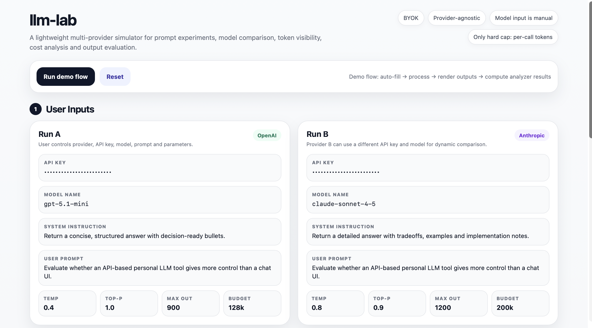

# llm-lab-mvp

**A lightweight LLM experimentation workspace for comparing prompts, models, token usage, cost, and context behavior across providers.**

> Public release: simulator + product architecture

> Full app code: available on request / in progress

---

## 🚀 Live Simulator

Try the product experience:

👉 https://davedepo.github.io/llm-lab-mvp/

---

## 🖼 Preview



---

## What this is

`llm-lab-mvp` is built for **control, comparison, and understanding** of LLM behavior.

It is designed for:

* prompt engineering
* multi-model comparison
* token & cost visibility
* context usage analysis
* output behavior evaluation

---

## Core Workflow (3 Layers)

| Layer                     | Purpose                                                           |
| --------                  | ----------------------------------------------------------------- |
| Inputs                    | Configure provider, model, prompt, system instruction, parameters |
| Outputs                   | Compare responses side-by-side                                    |
| Analyzer                  | Inspect tokens, cost, latency, and context pressure               |
| Difference Explanation    | Understand behavior difference, likely cause, and decision note   |

---

## Key Capabilities

* **BYOK (Bring Your Own Key)**
* **Multi-provider comparison**
* **Token usage tracking**
* **Cost estimation**
* **Context pressure analysis**
* **Output difference explanation**

---

## Current Status

This repository currently includes:

* Interactive simulator (`/docs/index.html`)
* GitHub Pages demo
* Product architecture
* Example experiment configuration

The full working application is being prepared and can be shared on request.

---

## Repository Structure

```bash
docs/        → simulator (live demo)
assets/      → screenshots
examples/    → experiment configs
src/         → app (placeholder)
```

---

## Simulator

The simulator demonstrates:

* input configuration (multi-provider)
* execution pipeline (visual flow)
* side-by-side outputs
* analyzer metrics: tokens, cost, latency, context pressure
* difference explanation: behavior difference, likely cause, decision note

---

## Why this exists

Most LLM tools optimize for **chat**.

`llm-lab-mvp` optimizes for:

* experimentation
* measurement
* control

It helps answer:

* Which model is better for this task?
* What is the cost impact?
* How do parameters affect output?
* How close am I to context limits?

---

## Code Availability

The simulator is public.

The full app implementation is currently private while being finalized.

To request access:

👉 Open an issue:
"Request access to llm-lab-mvp app code"

---

## Roadmap

* Streamlit app (interactive UI)
* Provider adapters (OpenAI, Anthropic, Gemini)
* BYOK handling
* Token + cost engine
* Experiment history
* Exportable results

---

## Security Note

* Never commit API keys
* Use `.env` for local testing
* Prefer session-based key usage

---

## License

MIT
